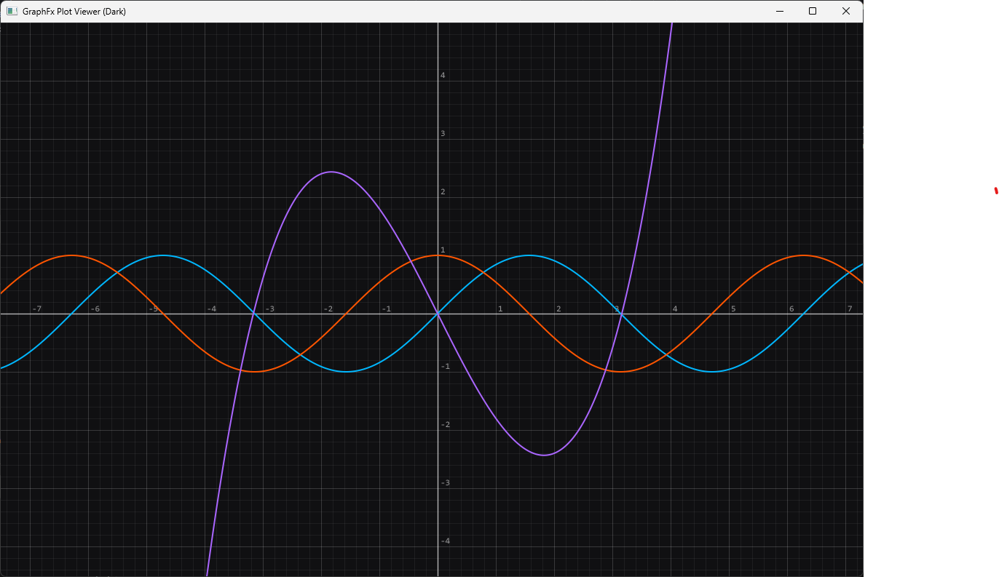
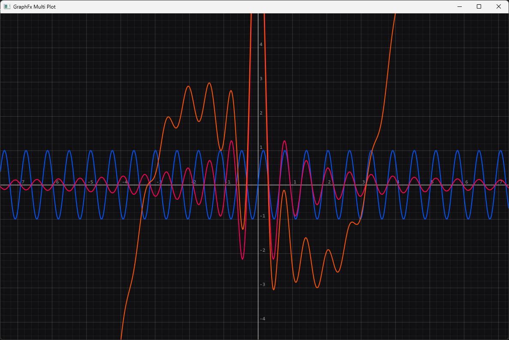
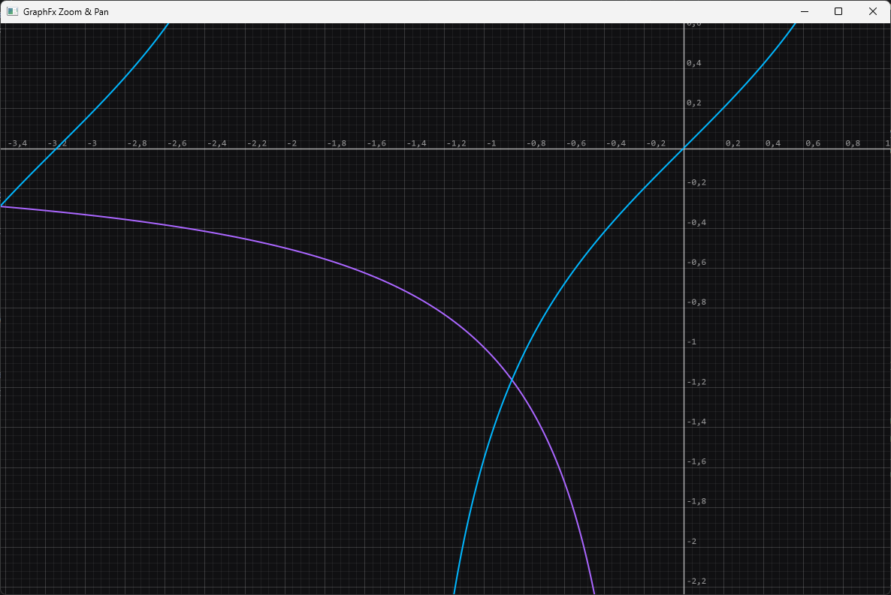
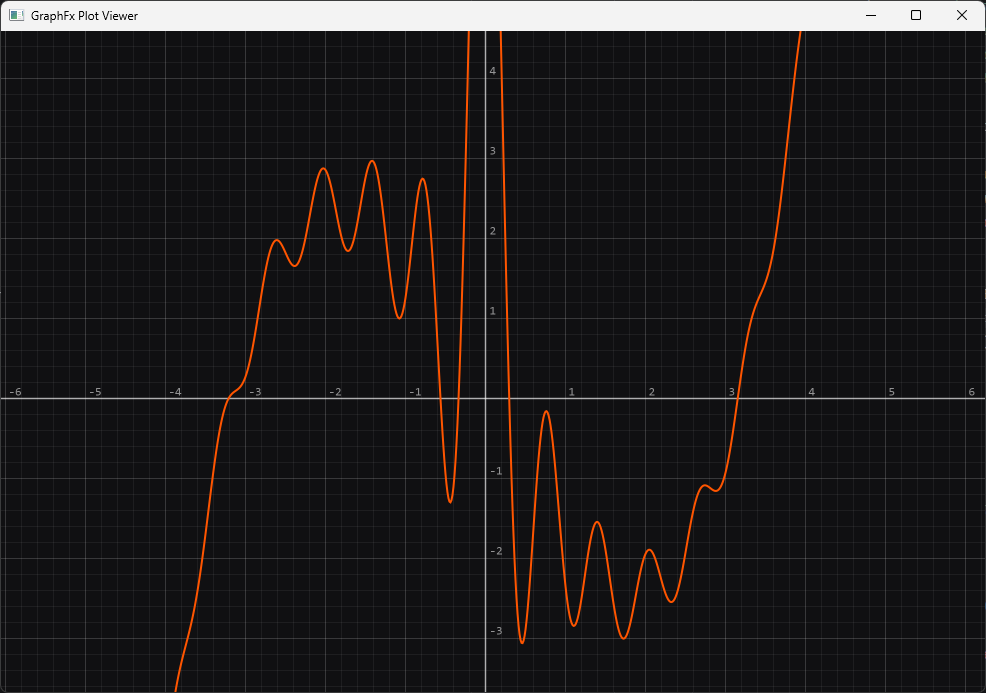
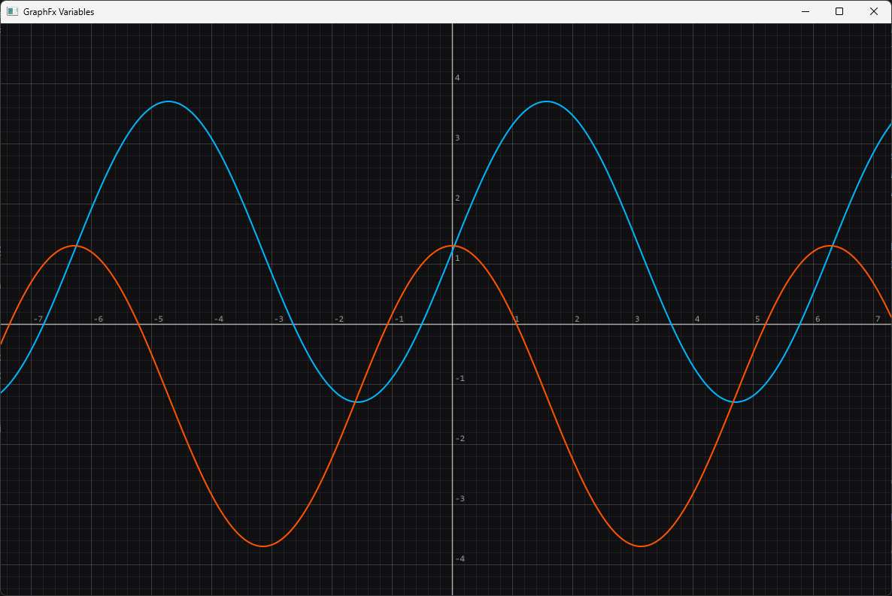
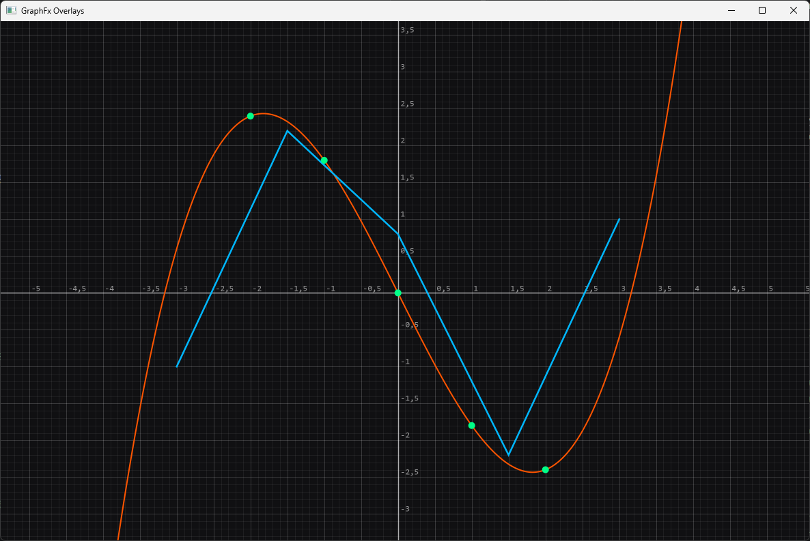

# 📐 JustMath

**JustMath** is a high-precision, extensible **Java math library** featuring its own `BigNumber` class and a modern
**string-based calculation engine**. It is designed to evaluate **complex mathematical expressions with virtually
unlimited precision**, avoiding the limitations of primitive types like `double` or `float`.

## 🧮 Features

- ✅ **Virtually unlimited precision** via `BigNumber`
- ✅ **String-based expression evaluation**
- ✅ **Supports trigonometry, logarithms, combinatorics, summations, coordinates, factorials, and many more**

## 🔢 BigNumber

The `BigNumber` class supports a wide range of mathematical operations:

| Category                         | Methods                                                                |
|----------------------------------|------------------------------------------------------------------------|
| **Basic Arithmetic**             | `add`, `subtract`, `multiply`, `divide`, `modulo`, `power`             |
| **Roots & Powers**               | `squareRoot`, `cubicRoot`, `nthRoot`, `exp`, `factorial`               |
| **Logarithms**                   | `log2`, `log10`, `ln`, `logBase`                                       |
| **Trigonometry**                 | `sin`, `cos`, `tan`, `cot`, `atan`, `acot`, `atan2`                    |
| **Hyperbolic Functions**         | `sinh`, `cosh`, `tanh`, `coth`                                         |
| **Inverse Hyperbolic Functions** | `asinh`, `acosh`, `atanh`, `acoth`                                     |
| **Combinatorics**                | `combination`, `permutation`                                           |
| **Series**                       | `summation`, `product`                                                 |
| **Coordinate Transformations**   | `polarToCartesianCoordinates`, `cartesianToPolarCoordinates`           |
| **Miscellaneous**                | `randomIntegerForRange`, `percentFromM`, `isXPercentOfN`, `gcd`, `lcm` |
| **Special Functions**            | `gamma`, `beta`, `abs`                                                 |
| **Statistics**                   | `sum`, `average`, `median`                                             |

All methods support customizable **`MathContext`** and **`Locale` settings** to meet international precision and
formatting requirements.

## 📃 BigNumberList – High-Precision Collections

BigNumberList is a domain-specific, list-like container for BigNumber instances.
It implements java.util.List<BigNumber> and adds high-level statistical, transformation, and sorting utilities on top.

### ✅ Core Capabilities
| Category                 | Methods                                                                                                         | Description                                              |
|--------------------------|------------------------------------------------------------------------------------------------------------------|----------------------------------------------------------|
| **Construction**         | `BigNumberList()`, `BigNumberList(List<BigNumber>)`, `of(...)`, `fromStrings(...)`, `copy`, `clone`             | Create lists from existing values or string representations |
| **Conversion**           | `toUnmodifiableList`, `toBigNumberArray`, `toStringList`, `toDoubleArray`                                      | Convert to arrays, immutable views, or string/double lists |
| **Sorting**              | `sort(Class<? extends SortingAlgorithm>)`, `sortAscending`, `sortDescending`                                   | Sort using custom algorithms or natural order            |
| **Statistics**           | `sum`, `average`, `median`, `modes`, `min`, `max`, `range`, `variance`, `standardDeviation`, `geometricMean`, `harmonicMean` | High-precision statistical operations                    |
| **Transformations**      | `absAll`, `negateAll`, `scale`, `translate`, `powEach`, `clampAll`, `normalizeToSum`, `reverse`, `shuffle`, `rotate`, `map` | In-place or copy-based transformations on all elements   |
| **Structure & Sets**     | `distinct`, `append`, `subListCopy`                                                                             | Remove duplicates, concatenate lists, copy subranges     |
| **Predicates & Queries** | `anyMatch`, `allMatch`, `findFirst`, `filter`, `isSortedAscending`, `isSortedDescending`, `isMonotonicIncreasing`, `isMonotonicDecreasing` | Query list properties in a numerically robust way        |

All higher-level operations are implemented in terms of BigNumber’s arbitrary precision arithmetic and comparison,
avoiding issues with primitive types.

### 🧮 Example: Working with BigNumberList
```java
// Create a high-precision list
BigNumberList numbers = BigNumberList.of(
new BigNumber("3"),
new BigNumber("1"),
new BigNumber("2"),
new BigNumber("2")
);

// Sort ascending using the built-in natural order
numbers.sortAscending();
System.out.println(numbers);
// [1, 2, 2, 3]

// Compute statistics
BigNumber sum     = numbers.sum();       // 8
BigNumber avg     = numbers.average();   // 2
BigNumber median  = numbers.median();    // 2
Set<BigNumber> modes = numbers.modes();  // {2}

// Transform values in-place
numbers.negateAll();                     // [-1, -2, -2, -3]
numbers.absAll();                        // [1, 2, 2, 3]

// Use a custom sorting algorithm
numbers.sort(QuickSort.class);           // Uses your SortingAlgorithm implementation
```

## 🧩 BigNumberMatrix – High-Precision Matrices

The `BigNumberMatrix` class extends the power of `BigNumber` into **linear algebra**.
It supports creation from **dimensions, strings, or nested lists** and provides a wide range of matrix operations with arbitrary precision.

### ✅ Supported Matrix Operations

| Category             | Methods                                                                 |
| -------------------- | ----------------------------------------------------------------------- |
| **Basic Arithmetic** | `add`, `subtract`, `multiply`, `divide` (element-wise)                  |
| **Matrix Algebra**   | `multiply` (matrix product), `power`, `inverse`, `determinant`, `trace` |
| **Transformations**  | `transpose`, `scalarMultiply`, `negate`                                 |
| **Properties**       | `isSquare`, `isSymmetric`, `isZeroMatrix`, `isIdentityMatrix`           |
| **Aggregates**       | `sumElements`, `max`, `flatten`                                         |
| **Utilities**        | `equalsMatrix`, `clone`, `forEachElement`, `forEachIndex`               |

All operations are **locale-aware** and preserve the formatting/parsing rules of `BigNumber`.

### 🧮 Example: Creating and Using Matrices

```java
// Create a 2x2 matrix from a string
BigNumberMatrix a = new BigNumberMatrix("1,2;3,4", Locale.US);

// Compute the determinant
BigNumber det = a.determinant();
System.out.println(det);
// -2

// Compute the inverse
BigNumberMatrix inv = a.inverse();
System.out.println(inv.toPlainDataString());
// [[-2.0, 1.0], [1.5, -0.5]]

// Multiply matrices
BigNumberMatrix b = new BigNumberMatrix("5,6;7,8", Locale.US);
BigNumberMatrix c = a.multiply(b);
System.out.println(c.toPlainDataString());
// [[19, 22], [43, 50]]

// Check identity matrix
BigNumberMatrix i = new BigNumberMatrix("1,0;0,1", Locale.US);
System.out.println(i.isIdentityMatrix());
// true
```


## 🔧 CalculatorEngine – Evaluate Math Strings

The built-in **CalculatorEngine** directly evaluates mathematical strings and supports all operators and functions listed in the following table:

### ✅ Supported Operators & Functions

| Category                         | Operator / Function                              | Description                        |
|----------------------------------|--------------------------------------------------|------------------------------------|
| **Arithmetic**                   | `+`, `-`, `*`, `/`                               | Basic operations                   |
|                                  | `%`, `^`, `!`                                    | Modulo, exponentiation, factorial  |
| **Roots**                        | `√(x)`, `sqrt(x)`                                | Square root                        |
|                                  | `³√(x)`, `cbrt(x)`                               | Cube root                          |
|                                  | `rootn(a, n)`                                    | n-th root                          |
| **Logarithms**                   | `log2(x)`                                        | Base-2 logarithm                   |
|                                  | `log(x)`                                         | Base-10 logarithm                  |
|                                  | `ln(x)`                                          | Natural logarithm                  |
|                                  | `logbase(x, b)`                                  | Logarithm with arbitrary base      |
| **Trigonometry**                 | `sin(x)`, `cos(x)`                               | Sine, cosine                       |
|                                  | `tan(x)`, `cot(x)`                               | Tangent, cotangent                 |
|                                  | `atan(x)`, `tan⁻¹(x)`                            | Arctangent                         |
|                                  | `acot(x)`, `cot⁻¹(x)`                            | Arccotangent                       |
|                                  | `atan2(y, x)`                                    | Two-argument arctangent            |
| **Hyperbolic Functions**         | `sinh(x)`, `cosh(x)`                             | Hyperbolic sine, cosine            |
|                                  | `tanh(x)`, `coth(x)`                             | Hyperbolic tangent, cotangent      |
| **Inverse Hyperbolic Functions** | `asinh(x)`, `sinh⁻¹(x)`                          | Inverse hyperbolic sine            |
|                                  | `acosh(x)`, `cosh⁻¹(x)`                          | Inverse hyperbolic cosine          |
|                                  | `atanh(x)`, `tanh⁻¹(x)`                          | Inverse hyperbolic tangent         |
|                                  | `acoth(x)`, `coth⁻¹(x)`                          | Inverse hyperbolic cotangent       |
| **Combinatorics**                | `nCr(n, r)`, `comb(n, r)`                        | Combinations                       |
|                                  | `nPr(n, r)`, `perm(n, r)`                        | Permutations                       |
| **Series**                       | `∑(start; end; expr)`                            | Sigma notation (e.g., ∑(0;10;2^k)) |
|                                  | `sum(start; end; expr)`                          | Named summation function           |
|                                  | `∏(start; end; expr)`                            | Product notation (e.g., ∏(1;4;k))  |
|                                  | `prod(start; end; expr)`                         | Named product function             |
| **Number Theory**                | `GCD(a, b)`                                      | Greatest common divisor            |
|                                  | `LCM(a, b)`                                      | Least common multiple              |
| **Random Generator**             | `RandInt(min, max)`                              | Random integer in a given range    |
| **Coordinates**                  | `Pol(x, y)`                                      | Cartesian → Polar                  |
|                                  | `Rec(r, θ)`                                      | Polar → Cartesian                  |
| **Special Functions**            | `Γ(x, y)`, `gamma(x)`                            | Gamma                              |
|                                  | `B(x, y)`, `beta(x, y)`                          | Beta                               |
|                                  | `\|x\|`, `abs(x)`                                | Absolute value                     |
| **Statistics**                   | `avg(n1, n2, n3, ...)`, `average(n1, n2, n3...)` | Average of n elements              |
|                                  | `sum(n1, n2, n3, ...)`                           | Sum of n elements                  |
|                                  | `median(n1, n2, n3, ...)`                        | Median of n elements               |

## 🔤 Variables

JustMath allows you to **define and substitute variables** directly in expressions.  
Variables are passed as a `Map<String, String>` when calling `evaluate`.

- Variables can be reused across nested evaluations.
- An **exception** is thrown if an undefined variable is encountered.

### ✅ Example: Using Variables

```java
CalculatorEngine calculator = new CalculatorEngine();

// Define variables
Map<String, String> variables = new HashMap<>();
variables.put("a", "5+3");
variables.put("b", "3");

// Evaluate expression with variables
BigNumber result = calculator.evaluate("2*a + b^2", variables);

System.out.println(result);
// 25

// Call other variables in a variable
variables = new HashMap<>();
variables.put("a", "root(b)");
variables.put("b", "3");

result = calculator.evaluate("2*a + b^2", variables);

System.out.println(result);
// 12.464101615...
```

## 📚 Static Utility Methods

JustMath provides a suite of **static utility methods** grouped in dedicated classes. These can be used independently of
`BigNumber` or `CalculatorEngine` for direct access to high-precision calculations.

| Class                                | Method(s)                                                                                                                                  | Description                                              |
|--------------------------------------|--------------------------------------------------------------------------------------------------------------------------------------------|----------------------------------------------------------|
| `BasicMath`                          | `add`, `subtract`, `multiply`, `divide`, `modulo`, `power`                                                                                 | Basic arithmetic operations                              |
|                                      | `factorial`, `exp`                                                                                                                         | Factorial and exponential function                       |
| `CombinatoricsMath`                  | `combination`, `permutation`                                                                                                               | Calculate combinations (nCr) and permutations (nPr)      |
| `CoordinateConversionMath`           | `polarToCartesianCoordinates`, `cartesianToPolarCoordinates`                                                                               | Convert between polar and cartesian coordinates          |
| `HyperbolicTrigonometricMath`        | `sinh`, `cosh`, `tanh`, `coth`                                                                                                             | Hyperbolic sine, cosine, tangent, and cotangent          |
| `InverseHyperbolicTrigonometricMath` | `asinh`, `acosh`, `atanh`, `acoth`                                                                                                         | Inverse hyperbolic functions                             |
| `InverseTrigonometricMath`           | `asin`, `acos`, `atan`, `acot`                                                                                                             | Inverse trigonometric functions                          |
| `LogarithmicMath`                    | `log2`, `log10`, `ln`, `logBase`                                                                                                           | Binary, decimal, natural, and arbitrary base logarithms  |
| `MatrixMath`                         | `add`, `subtract`, `multiply`, `divide`, `scalarMultiply`, `transpose`, `determinant`, `inverse`, `power`, `minor`, `identity`, `adjugate` | Matrix operations                                        |
| `NumberTheoryMath`                   | `gcd`, `lcm`                                                                                                                               | Greatest common divisor and least common multiple        |
| `PercentageMath`                     | `nPercentFromM`, `xIsNPercentOfN`                                                                                                          | Percent calculations                                     |
| `RadicalMath`                        | `squareRoot`, `cubicRoot`, `nthRoot`                                                                                                       | Compute square, cube, and n-th roots                     |
| `TrigonometricMath`                  | `sin`, `cos`, `tan`, `coth`                                                                                                                | Trigonometric functions (coth also here for convenience) |
| `TwoDimensionalMath`                 | `atan2`                                                                                                                                    | Two-argument arctangent                                  |
| `MathUtils`                          | `convertAngle`, `bigDecimalRadiansToDegrees`, `bigDecimalNumberToRadians`                                                                  | Angle conversions                                        |
|                                      | `randomIntegerBigNumberInRange`                                                                                                            | Random integer generation using `BigNumber`              |
|                                      | `e`, `pi`                                                                                                                                  | Mathematical constants as `BigNumber`                    |
| `SeriesMath`                         | `summation`                                                                                                                                | Summation logic                                          |
|                                      | `product`                                                                                                                                  | Product logic                                            |
|                                      | `product`                                                                                                                                  | Product logic                                            |
| `SpecialFunctionMath`                | `gamma`, `beta`                                                                                                                            | Gamma and Beta special functions                         | 
| `StatisticsMath`                     | `sum`, `average`, `median`                                                                                                                 | Sum and average of provided elements                     | 
 
## 📐 Constants

The `BigNumbers` class provides reusable **high-precision constants** and default configuration values that are
used throughout JustMath. These can be accessed statically and are ideal for custom calculations or configurations.

| Constant                     | Description                                     |
|------------------------------|-------------------------------------------------|
| `CALCULATION_LOCALE`         | Default `Locale` used for parsing/formatting    |
| `DEFAULT_DIVISION_PRECISION` | Default precision for division operations       |
| `DEFAULT_MATH_CONTEXT`       | Default `MathContext` with precision & rounding |
| `NEGATIVE_ONE`               | BigNumber value of -1                           |
| `ZERO`                       | BigNumber value of 0                            |
| `ONE`                        | BigNumber value of 1                            |
| `TWO`                        | BigNumber value of 2                            |
| `THREE`                      | BigNumber value of 3                            |
| `ONE_HUNDRED`                | BigNumber value of 100                          |
| `ONE_HUNDRED_EIGHTY`         | BigNumber value of 180                          |

## 🧭 Algorithms

You can also sort a `List<BigNumber>` using any of the following algorithms.

| Algorithm                         |
|-----------------------------------|
| `QuickSort`                       |

### ✅ Example: Using Algorithms

```java
List<BigNumber> numbers = Arrays.asList(
        new BigNumber("3.14"),
        new BigNumber("2.71"),
        new BigNumber("1.41"),
        new BigNumber("1.73")
);

numbers = QuickSort.sort(numbers); // [1.41, 1.73, 2.71, 3.14]
```

## 🧑‍💻 Practical Examples

### ➕ Add Very Large Numbers

```java
BigNumber num1 = new BigNumber("8736519650165165946166562572365809265462671456");
BigNumber num2 = new BigNumber("143153651451954101155145145169254155145");
BigNumber sum = num1.add(num2);

System.out.println(sum);
// 8736519793318817398120663727510954434716826601
```

### ➖ Subtract Small Decimals

```java
BigNumber a = new BigNumber("0.0000000001");
BigNumber b = new BigNumber("0.00000000009");
BigNumber diff = a.subtract(b);

System.out.println(diff);
// 0.00000000001
```

### ➗ High-Precision Fractions

```java
BigNumber e = new BigNumber("1");
BigNumber f = new BigNumber("3");
BigNumber quotient = e.divide(f, new MathContext(50, RoundingMode.HALF_UP));

System.out.println(quotient);
// 0.33333333333333333333333333333333333333333333333333
```

### ⚡ Power with Negative Exponents

```java
BigNumber base = new BigNumber("-1.2");
BigNumber exponent = new BigNumber("-2.99");
BigNumber result = base.power(exponent);

System.out.println(result);
// -0.5797597677291667131944984780245747754620911770325891258918945726243986428499938555808865049096166498
```

### ∑ Sigma Summation (Custom Expression)

```java
CalculatorEngine calculator = new CalculatorEngine(50, TrigonometricMode.DEG);
BigNumber result = calculator.evaluate("∑(0;5;k^2+1)");
// Equivalent: sum(0;5;k^2+1)

System.out.println(result);
// 61
```

## 📈 GraphFx

### High-Precision Function Plotting for JustMath

**GraphFx** is the official **JavaFX plotting and visualization module** for **JustMath**.
It renders mathematical expressions defined as **strings** and evaluates them using the calculation engine
with high numerical precision.
GraphFx is designed as a **developer-oriented library component** and can be embedded into custom JavaFX applications
or shown as a standalone plotting window.

### ️ Screenshots

<p align="center">
  
  <br/>
  <em>GraphFx main window – dark theme</em>
</p>

<p align="center">
  
  <br/>
  <em>Multiple expressions plotted simultaneously</em>
</p>

<p align="center">
  
  <br/>
  <em>Zooming &amp; panning interaction</em>
</p>

### ✨ Features

GraphFx focuses on the features developers typically need when building mathematical tools: the ability to plot
expressions quickly, understand behavior interactively, and present results in a clean and configurable UI.

* 🧮 String-based expression plotting
Expressions are provided as plain strings, which makes GraphFx easy to integrate into apps where users type
mathematical formulas or where expressions come from external sources.

* 🔢 Powered by JustMath’s high-precision engine
The same engine that evaluates expressions in JustMath is used for plotting, ensuring consistency and high precision.

* 🔤 Variable support via Map<String, String>
Variables are passed exactly like in the JustMath engine: Map<String, String>. This allows not only numeric values
but also full sub-expressions as variable values.

* 🖱️ Interactive coordinate system
GraphFx supports smooth exploration. You can zoom in to inspect local behavior (e.g., oscillations) and pan to follow
the curve across the coordinate system.

* 🎨 Light & dark themes
You can style the plot window to match your application design or user preference.

* 📊 Multiple expressions per plot
Plot multiple curves at once to compare functions, check identities, or visualize overlays (e.g., approximation vs.
original function).

* 📍 Overlay layers (points & polylines)
Besides function plots, GraphFx supports manual overlays, which is useful for marking specific points, visualizing
computed data, or drawing custom paths.

* 🔒 Thread-safe public API
Most library users do not want to manually manage the JavaFX application thread. GraphFx therefore wraps UI dispatch
internally and allows calling public methods from any thread safely.

### 📋 GraphFx API Overview

The GraphFxPlotViewer class acts as the main entry point for library users. It can be used as a standalone window or
embedded into other JavaFX layouts. Expression plots are created by calling `plotExpression(...)`, which returns a plot
id that can later be removed again. Manual overlays (points and polylines) are independent from expression plots and can
be cleared or replaced at any time.

| Category                | Method                                                                          | Description                                         |
| ----------------------- | ------------------------------------------------------------------------------- | --------------------------------------------------- |
| **Window Lifecycle**    | `show()`                                                                        | Shows the plot viewer using default window settings |
|                         | `show(String title, double width, double height)`                               | Shows the viewer with a custom title and size       |
|                         | `hide()`                                                                        | Hides the window without disposing it               |
|                         | `dispose()`                                                                     | Closes the window and releases all resources        |
| **Embedding**           | `asNode()`                                                                      | Returns an embeddable JavaFX node                   |
| **Expression Plotting** | `plotExpression(String expression, String color)`                               | Plots an expression without variables               |
|                         | `plotExpression(String expression, Map<String,String> variables, String color)` | Plots an expression with variables                  |
|                         | `removeExpressionPlot(long plotId)`                                             | Removes a plotted expression                        |
|                         | `clearExpressionPlots()`                                                        | Removes all plotted expressions                     |
| **Viewport Control**    | `centerOrigin()`                                                                | Centers the coordinate system at (0, 0)             |
| **Themes**              | `setTheme(DisplayTheme theme)`                                                  | Applies a light or dark theme                       |
| **Overlay – Points**    | `setPoints(List<Point2D> points)`                                               | Draws manual points in world coordinates            |
|                         | `setPointStyle(Color color, double radiusPx)`                                   | Changes point color and size                        |
| **Overlay – Polyline**  | `setPolyline(List<Point2D> polyline)`                                           | Draws a manual polyline                             |
|                         | `setPolylineStyle(Color color, double widthPx)`                                 | Changes polyline color and width                    |

### 🚀 Quick Start

The simplest way to use GraphFx is the standalone window mode. Create a viewer, plot one or more expressions, center
the origin and call `show()`. This is perfect for debugging expressions or quickly validating a formula visually.

```java
public static void main(final String[] args) {
    GraphFxPlotViewer viewer = new GraphFxPlotViewer(DisplayTheme.DARK);

    viewer.plotExpression("sin(10x)/x + 0.2x^3 - 2x", "#ff5500");
    viewer.centerOrigin();
    viewer.show();
}
```

<p align="center">
  
  <br/>
  <em>Quick start output</em>
</p>

### 🔤 Variables (`Map<String, String>`)

GraphFx uses the same variable model as the JustMath CalculatorEngine: variables are passed as a
`Map<String, String>`. This is a deliberate design choice because it enables much more than numeric substitution.
Variable values can be simple literals like "2.5", but they can also be full expressions like "5+3" or
`root(b)`. Variable substitution and evaluation are performed by the calculation engine and are therefore consistent
with the rest of JustMath.

```java
Map<String, String> variables = new HashMap<>();
variables.put("a", "2.5");
variables.put("b", "1.2");

viewer.plotExpression("a*sin(x) + b", variables, "#00B7FF");
```

<p align="center">
  
  <br/>
  <em>Variable-based plot</em>
</p>

### 📍 Overlays (Points & Polylines)

Expression plots are not the only thing you may want to visualize. In many real applications you compute data points
(e.g., samples, measurements, roots, intersections, or numerical solutions) and want to display them together with a
function. GraphFx therefore supports manual overlays that are drawn on top of the plot. These overlays use world
coordinates (the same coordinate system as the function plot) and automatically scale and translate with the viewport.

`setPoints(...)` replaces all overlay points at once, which makes it easy to render scatter plots or highlight special
points. `setPolyline(...)` draws a custom connected path. Together, these overlays can be used to visualize discrete
data on top of continuous functions or to show algorithmic results such as approximation curves.

```java
viewer.setPoints(List.of(
        new Point2D(-2, 1),
        new Point2D(0, 0),
        new Point2D(2, -1)
));

viewer.setPolyline(List.of(
        new Point2D(-3, -1),
        new Point2D(-1, 2),
        new Point2D(1, -2),
        new Point2D(3, 1)
));
```

<p align="center">
  
  <br/>
  <em>Overlay example</em>
</p>

## ⚙️ Maven (Coming Soon)

Cannot wait? Just download the latest jar:

<table style="width:100%">
  <tr>
    <th>Version</th>
    <th>Download</th>
    <th>Release Type</th>
  </tr>
  <tr>
    <td>v1.2.2.13</td>
    <td><a href="out/artifacts/justmath_jar/justmath-1.2.2.13.jar">JustMath v1.2.2.13</a></td>
    <td>Preview</td>
  </tr>
  <tr>
    <td>v1.2.2</td>
    <td><a href="out/artifacts/justmath_jar/justmath-1.2.2.jar">JustMath v1.2.2</a></td>
    <td>Release</td>
  </tr>
  <tr>
    <td>v1.2.1</td>
    <td><a href="out/artifacts/justmath_jar/justmath-1.2.1.jar">JustMath v1.2.1</a></td>
    <td>Preview</td>
  </tr>
 <tr>
    <td>v1.2.0</td>
    <td><a href="out/artifacts/justmath_jar/justmath-1.2.0.jar">JustMath v1.2.0</a></td>
    <td>Release</td>
  </tr>
 <tr>
    <td>v1.1.5</td>
    <td><a href="out/artifacts/justmath_jar/justmath-1.1.5.jar">JustMath v1.1.5</a></td>
    <td>Release</td>
  </tr>
 <tr>
    <td>v1.1.4</td>
    <td><a href="out/artifacts/justmath_jar/justmath-1.1.4.jar">JustMath v1.1.4</a></td>
    <td>Release</td>
  </tr>
  <tr>
    <td>v1.0.3</td>
    <td><a href="out/artifacts/justmath_jar/justmath-1.0.3.jar">JustMath v1.0.3</a></td>
    <td>Release</td>
  </tr>
  <tr>
    <td>v1.0.2</td>
    <td><a href="out/artifacts/justmath_jar/justmath-1.0.2.jar">JustMath v1.0.2</a></td>
    <td>Release</td>
  </tr>
  <tr>
    <td>v1.0.1</td>
    <td><a href="out/artifacts/justmath_jar/justmath-1.0.1.jar">JustMath v1.0.1</a></td>
    <td>Release</td>
  </tr>
  <tr>
    <td>v1.0.0</td>
    <td><a href="out/artifacts/justmath_jar/justmath-1.0.0.jar">JustMath v1.0.0</a></td>
    <td>Release</td>
  </tr>
</table>

Need something newer than the latest release? You can find the newest (possibly unstable) builds on the <a href="https://github.com/lembergmax/JustMath/tree/developer">developer</a> branch.

## 📜 License

**MIT License**

You are free to:

* use
* copy
* modify
* merge
* publish
* distribute
* sublicense
* and/or sell copies of JustMath

for both private and commercial purposes, **as long as the original license and copyright
notice are included** in all copies or substantial portions of the software.

👉 [MIT License – Full Text](https://opensource.org/licenses/MIT)

## 👤 Author

**Max Lemberg**
🔗 [GitHub Profile](https://github.com/lembergmax)

© 2025 Max Lemberg. All rights reserved.
Licensed under the MIT License.
