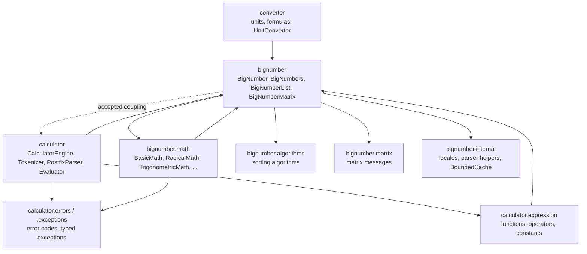
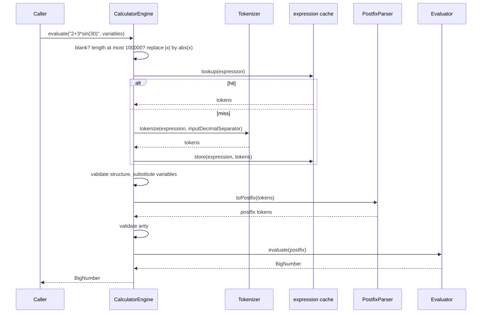
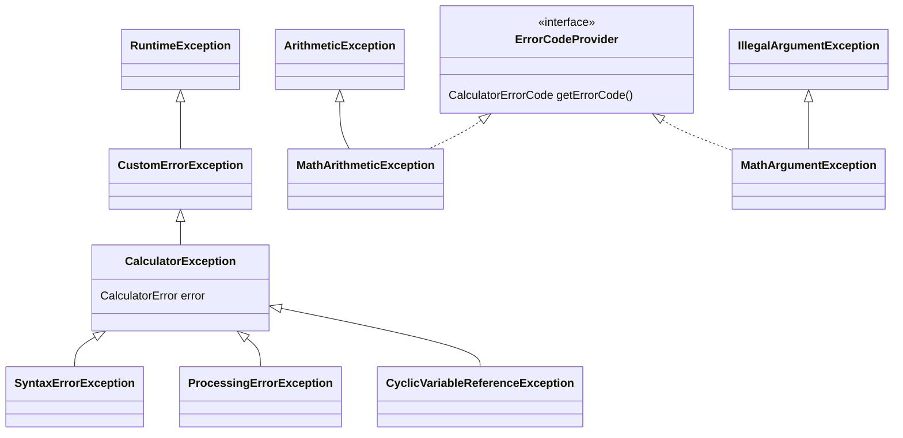
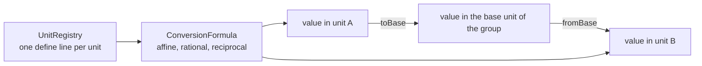

# Architecture

JustMath is a library of about 110 classes in 21 packages. It has four parts: the number type with its math, the expression engine that evaluates text, collections and matrices, and the unit converter. This page describes how they fit together. The diagrams are [Mermaid](https://mermaid.js.org/), which GitHub renders.

Decisions that surprise readers are written down in [decisions/](decisions/README.md). How to add a function, an operator, a unit or a sorting algorithm is in [extending.md](extending.md).

## Packages

| Package | Responsibility |
| --- | --- |
| `bignumber` | The value types `BigNumber`, `BigNumberCoordinate`, `BigNumberList`, `BigNumberMatrix` and `MultiValueResult`, the constants in `BigNumbers` and the parser of numeric strings. |
| `bignumber.math` | Static, stateless math classes. `BigNumber` delegates its operations to them. |
| `bignumber.math.utils` | `MathUtils`: the limit of a `MathContext`, `computeWithGuardDigits` and the angle conversion that the math classes share. |
| `bignumber.math.exceptions` | `MathArgumentException` and `MathArithmeticException`, both carry a `CalculatorErrorCode`. |
| `bignumber.algorithms` | The eight sorting algorithms behind `BigNumberList.sort`. |
| `bignumber.matrix` | The element callback and the localized messages of `BigNumberMatrix`. |
| `bignumber.internal` | Locale tables, separator handling, the number checker and `BoundedCache`. The classes are public because other packages use them, but they are not supported API. |
| `calculator` | `CalculatorEngine` and the pipeline (`Tokenizer`, `PostfixParser`, `Evaluator`). Only `CalculatorEngine` and `SupportedLanguages` are public. |
| `calculator.expression` | The registry of functions, operators and constants, and their operations. |
| `calculator.errors` and `calculator.exceptions` | Error codes, localized errors, `CalculatorResult` and the exception hierarchy. |
| `calculator.internal` | `TrigonometricMode` and `CoordinateType`, public because public methods take them as parameters. |
| `converter` | Units, conversion formulas, `UnitConverter`, `UnitValue` and its parser. |
| `exceptions` | The base types of all exceptions. |

`PackageDependencyTest` reads the imports and fails when a package depends on one that it must not know. The rules it enforces:

- `converter` knows `bignumber` and `bignumber.internal`, never `calculator`.
- `bignumber.algorithms` and `bignumber.matrix` know only `bignumber`.
- The operations under `calculator.expression.operations` know only `bignumber` and `calculator.internal`.
- The expression model does not import the tokenizer, the parser, the evaluator or the engine.
- `exceptions` imports nothing of the library, and nothing imports the root package that holds the demo class.

`BigNumber` imports `CalculatorEngine` because it evaluates sub-expressions lazily, and the math classes use `calculator.errors` for the error codes and `calculator.internal.TrigonometricMode`. That coupling between `bignumber` and `calculator` is accepted, and it is not extended.

## The expression pipeline

`CalculatorEngine.evaluate(expression, variables)` runs five steps. Each step has one input and one output, and an error of a step is reported with the code of that step.

| Step | Class | What it does | Errors |
| --- | --- | --- | --- |
| Lexing | `Tokenizer` | Splits the text into tokens: numbers, operators, unary operators, functions, parentheses, separators, constants, variables. Collapses runs of signs, inserts implicit multiplication and treats whitespace as a separator. | `SYNTAX_INVALID_CHARACTER`, `SYNTAX_UNKNOWN_FUNCTION` |
| Structure | `CalculatorEngine` | Checks the infix tokens before anything is computed, so `50000!/` fails at once instead of computing `50000!`. Substitutes variables and rejects cycles. | `SYNTAX_LEADING_OPERATOR`, `SYNTAX_TRAILING_OPERATOR`, `SYNTAX_EMPTY_PARENTHESES`, `SYNTAX_UNKNOWN_VARIABLE` |
| Parsing | `PostfixParser` | Shunting-yard: converts the tokens to reverse Polish notation with the precedence and the associativity of the registry. | `SYNTAX_UNMATCHED_PAREN`, `SYNTAX_MISPLACED_SEPARATOR` |
| Arity | `CalculatorEngine` | Checks that every function has the right number of arguments. | `SYNTAX_WRONG_ARGUMENT_COUNT` |
| Evaluation | `Evaluator` | Runs the postfix tokens on a stack of `BigNumber` and coordinate values. Exactly one `BigNumber` must remain. | `SYNTAX_MISSING_OPERAND`, `SYNTAX_UNEXPECTED_END`, math errors |

The element registry (`ExpressionElements`) is the single source for symbols, precedence, associativity and the operation behind each symbol. It is filled in a static initializer and is read-only afterwards. Binary and unary `+` and `-` live in two registries, because the same symbol has a different precedence in each role.

Cache: the engine can keep the token list of an expression in a least-recently-used cache (`setExpressionCacheEnabled`, `setExpressionCacheSize`, off by default, 128 entries). A hit skips the tokenizer. The cache is guarded by a private lock, and `BigNumber.clone()` detaches the lazily created engine so that two clones never share it.

The engine is configured through volatile fields (`locale`, `inputLocale`, `errorMode`, the cache switches). It is not designed to be shared by threads that reconfigure it while they evaluate. Evaluation state that must survive nested calls, the variables, is kept in a thread-local that is restored in a `finally` block.

## Errors

The math layer throws `MathArithmeticException` and `MathArgumentException`. They extend the JDK types, so existing callers that catch `ArithmeticException` or `IllegalArgumentException` keep working, and they carry a `CalculatorErrorCode`. The engine turns any exception into a `CalculatorError` through `RuntimeExceptionClassifier`, which reads the code from an `ErrorCodeProvider` and only falls back to the message of a foreign exception. Code and tests branch on the code, never on the text.

There are 25 codes in these groups: syntax, argument, math, range and internal. A `CalculatorError` has a code, named parameters and a technical English message. `ErrorMode.RAW` returns that message, `ErrorMode.USER_FRIENDLY` looks up a localized text in the bundles under `i18n/` with three tiers: the specific code, the category, then a generic text. `evaluateSafe...` and `evaluateTo...Result` never throw: they return a `CalculatorResult` with the value or the error, and they also catch `StackOverflowError` from deeply nested input.

## Numbers and precision

`BigNumber` holds a decimal value, a `Locale` for formatting, a `MathContext` and a `TrigonometricMode`. Its operations return new instances and leave the receiver alone. The few mutators are named for it: `*This` methods, `trim` and the Lombok setters. The shared constants in `BigNumbers` (`ZERO`, `ONE`, ...) are never returned to a caller, always a fresh instance, because a caller may mutate the result.

`BasicMath` implements addition, subtraction, multiplication, division, integer powers, `exp` and the fractional power on decimal digit strings. The rest of the math classes delegate the transcendental functions to [big-math](https://github.com/eobermuhlner/big-math).

How a result is rounded:

- Addition, subtraction, multiplication and non-negative integer powers are exact.
- Division, negative integer powers, `exp`, fractional powers, roots, logarithms and the trigonometric, hyperbolic and inverse functions round **once**, with the precision and the rounding mode of the caller's `MathContext`.
- Where the library function only guarantees an absolute error, `MathUtils.computeWithGuardDigits` evaluates with guard digits, reads the size of the result and repeats with more digits until every requested digit is right. A result that cannot be resolved in eight attempts is reported as `MATH_OVERFLOW`. Where the exact value is zero (`sin(180°)`) the result is zero.
- The property tests compare the functions with `BigDecimal`, `BigInteger` and `BigDecimalMath` on generated hard arguments (see [testing.md](testing.md)).

Locale only changes how a number is read and written. Comparison, hashing and arithmetic use the `BigDecimal` value. The engine reads input with `Locale.US` by default (`.` is the decimal separator and `;` the argument separator). `setInputLocale` is the opt-in for another input locale and is strict. `setLocale` only controls output formatting and the language of the errors.

## Units

`UnitRegistry` is the only place that knows the units. One `define` line gives a unit its enum constant, name, symbol and conversion formula. Formulas are separate classes (`AffineConversionFormula`, `RationalConversionFormula`, `RationalReciprocalConversionFormula` and the affine and reciprocal rational variants), so a ratio such as 5/9 is stored as a ratio and divided once at conversion time. A conversion always goes through the base unit of the group, so `n` units need `n` formulas, not `n * n`. Units of different groups cannot be converted and throw a `UnitConversionException`. Deprecated constants such as `Unit.DataStorage.KILOBYTE` resolve to the canonical unit and never appear in `all()`.

The values are checked against definitions: see [unit-audit.md](unit-audit.md) and the generated [units.md](units.md).

## Limits

An input that is small but asks for an enormous result is rejected with a typed error instead of being computed.

| Limit | Value | Where |
| --- | --- | --- |
| Expression length | 100000 characters | `CalculatorEngine` |
| Factorial argument | 100000 | `BasicMath` |
| Digits of an integer power | 1000000 | `BasicMath` |
| Size of `exp(x)` | `|x| * log10(e)` at most 1000000 | `BasicMath` |
| Combinatorial factors and result digits | 100000 and 1000000 | `CombinatoricsMath` |
| Iterations of `summation` and `product` | 1000000 | `SeriesMath` |
| Precision of a `MathContext` | 1000000 digits | `MathUtils` |
| Cached values of pi and e | 32 precisions | `BigNumbers` |

## Build and quality gates

`./mvnw verify` runs the unit and property tests, the JaCoCo coverage gate, SpotBugs with FindSecBugs, the Javadoc build with all warnings as errors, the Spotless formatting check, the Maven Enforcer rules and japicmp against the previous release. CI repeats it on JDK 21, 23 and 25, on Windows, under three default locales, and builds the jars twice to prove that they are identical. A weekly job runs PIT mutation tests. Releases are signed, come with an SBOM, checksums and a build provenance attestation, and wait for the maintainer's approval: see [releasing.md](releasing.md).
